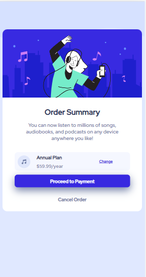
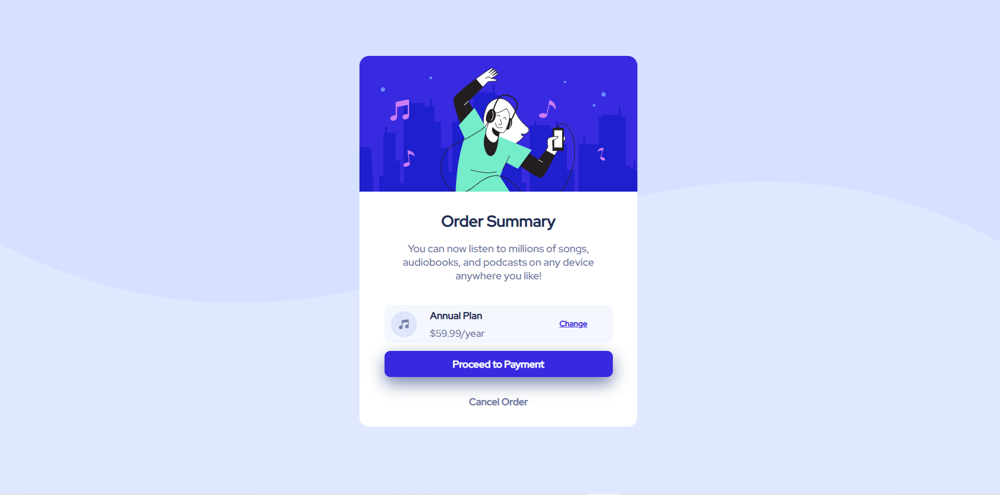

# Frontend Mentor - Order summary card solution

This is a solution to the [Order summary card challenge on Frontend Mentor](https://www.frontendmentor.io/challenges/order-summary-component-QlPmajDUj). Frontend Mentor challenges help you improve your coding skills by building realistic projects. 

## Table of contents

- [Overview](#overview)
  - [The challenge](#the-challenge)
  - [Screenshot](#screenshot)
  - [Links](#links)
- [My process](#my-process)
  - [Built with](#built-with)
  - [What I learned](#what-i-learned)
  - [Continued development](#continued-development)
  - [Useful resources](#useful-resources)
- [Help](#help)
- [Author](#author)
- [Acknowledgments](#acknowledgments)

## Overview

I have Order summary card site using HTML, CSS. I created two CSS styles file, One is (desktop-design.css) for desktop design and second is (mobile_design.css) for mobile design. Below are the mentions of all the styles and reference and my process on how to do made project, its beauty and what challenges I were facing.

### The challenge

Users should be able to:

- See hover states for interactive elements

### Screenshot


Above screenshot is of mobile view. That shows how it was design.


Above screenshot is of design view. That shows how it was design.

### Links

- Solution URL: [Add solution URL here](https://your-solution-url.com)
- Live Site URL: [Add live site URL here](https://your-live-site-url.com)

## My process

Processes are mentioned here to make this site:
1. Created ID in html file in body section for Order summary card card.
2. Added an image of person as you can see in that screenshot.
3. Insert heading, followed by paragraph.
4. For annual-plan, I have to do add cost of year for subscription and in right side I added **change** for change plan with using hover properties.
5. Then, using flexbox, I adjusted 2 boxes (Button1 = **Proceed to Payment** and Button2 = **Cancel Order**).
6. I use hover on Button1 and Button2 also. 

### Built with

- Semantic HTML5 markup
- CSS custom properties
- Flexbox

### What I learned

I used flex here for first time.
```css
.button{
    display: flex;
    flex-direction: column;
    padding: 13px 38px;
    font-size: 15px;
    margin: 16px 0px;
}
```

### Continued development

I'll continue this journey because lot of exploration is out there. This is my 3rd project using HTML, CSS but something is missing and that is JAVASCRIPT. I want to have a good practice in that also.

### Useful resources

- [Red Hat Display](https://fonts.google.com/specimen/Red+Hat+Display) - This helped me for XYZ reason. I really liked this pattern and will use it going forward.

## help

I want to used flexbox on the **class = plan** with button1 and button2 but I can't because layout of **plan** is ruptured.
So suggest me how to do it.

## Author

- Frontend Mentor - [@@codekesh](https://www.frontendmentor.io/profile/codekesh)
- Twitter - [@tulsyan_keshav](https://twitter.com/tulsyan_keshav)

## Acknowledgments

I am solo player for this project. I am beginner so for learning purpose, I tried my own and I think I give my best for making this website.